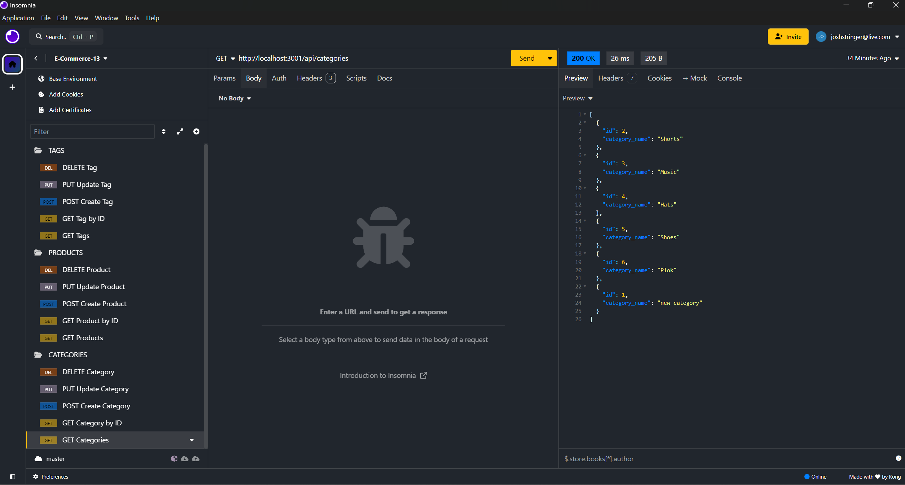

# e-commerce-13

Description: This repo was created to showcase a basic GET, POST, PUT, and DELETE requests within a database.

Installation: Run npm i in your terminal and update the .env file with your own user and password info.

Usage: To use this repo, run node index.js in your terminal and use Insomnia to test GET, POST, PUT, and DELETE requests. You can also examine the code to understand how these requests work.

Credits: Josh Stringer

License: Refer to the LICENSE in the repo.

Link to demo video:

